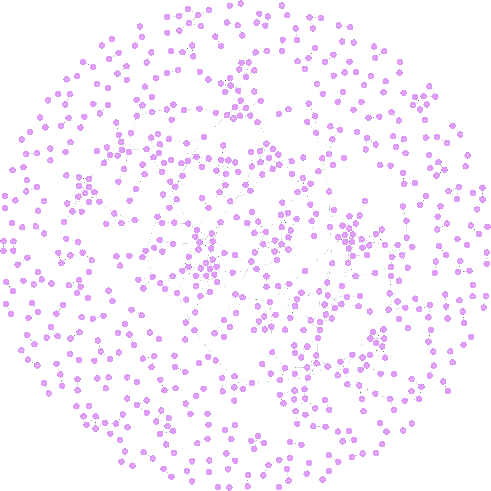

# How I generated the Polish word list for bip0039 using Python and a graph database (neo4j)

The reader should be familiar with the concept of backing up a key wallet and a key wallet itself.

## Motivation
If you want to back up your keys with a list of 12-24 words, you do not really have a choice in terms of the language.
At the time of writing this article there is only one choice - English. Other language versions start to pop up.
They are made in forms of pull requests to bip0039, i.e. Bitcoin Improvement Proposal 0039
(https://github.com/bitcoin/bips/tree/master/bip-0039). The fact some of those pull requests have been already merged
doesn't mean the wallets support them. Having great interest in both software engineering and different puzzles,
especially those involving playful language cleverness, I challenged myself with creating the Polish word list.
I am also an active software/hardware wallets user. Having already the pull request submitted I would like to share
some of my observations. I hope people thinking about creating missing language versions find some valuable insights
how to tackle it. At least for the languages with characters similar to English alphabet, like Polish.

Support for languages other than English without a doubt helps spreading the technology adoption. For sure it helps
to pass through the ranks of the early adopters.

## Reasonable requirements for a backup word list
I based my considerations on the following:
- general requirements (https://github.com/bitcoin/bips/blob/master/bip-0039.mediawiki),
- pragmatism to make life easier when using hardware wallets (two buttons only, display limited to 8 characters),
- pragmatism to produce/use any of those becoming more and more popular backups made out of steel (word length,
  character set)
- discussions from other pull requests and my personal linguistic taste.

All above gives us:
1. **The list consists of 2048 words and is sorted.**  
2. **Smart selection of words.** The first 4 letters uniquely determine a word. This is really helpful when going
through the process of recovering the password with two buttons only. The lower bound, due to the number of characters
in an alphabet seems to be 3, but it will most likely be not possible to achieve. Especially having in mind other
constraints. For Polish language it was definitely not possible.  
3. **Word length.** For upper bound I strongly opt for no more than 8, due to the displays limited to 8 characters.
It also helps to keep full words (not only 4 first letters) in the steel backups. Lower bound set to 4 characters seems
to be nicely aligned with other constraints.  
4. **Character set.** If your language allows it and if possible, I would start with words consisting of English
characters only. Again, this is due to the steel backups. I was able to achieve it with Polish word list, but I was
of impression this was one of the hardest constraints to met. It could be loosen up by treating letters with and without
diacritics as the same. Using Polish example, 'ą' would be treated as 'a' resulting in "kąt" being treated as "kat".  
5. **Similar words avoided.** To be more precise, I would use term 'Levenshtein distance'. Levenshtein distance of ONE
should not be allowed (unfortunately this rule does not apply to the English word list).  
6. **Common nouns only.** Plural form used only when there is no singular form/singular form is rarely used  
7. **All words should be manually selected:**
   - they should come from some kind of widely accepted source - I used words from Polish dictionary:
     https://sjp.pl/slownik/odmiany/
   - it is OK if some people especially children would not understand some of them,
  but it should not 'put in trouble' (no embarrassing words) people who know the meaning and are asked for explanation.  
8. **~~No words from other word lists~~** - could be nice feature but I do not think it is feasible. Especially with all
of those constraints - I very quickly stopped to think about it.  

## How would I do it (in hindsight)

### Prerequisites
Some scripting knowledge is for sure required. I used Python as I am familiar with it. Scripting will make work not only
easier but it is also a must due to the constraint involving Levenshtein distance.

You have to end up with a list of 2048 words. Write down your requirements and start with manually creating a way longer
list, lets's say about 3000.

### Initial list
Having decided on word length 4-8 and the character set, I filtered out all the other words from the abovementioned
Polish word list. Then comes the hardest part - you have to manually select the words. I did it all myself, but
I would recommend split this work. Firstly, doing it yourself you spend tens of hours (was it fifty in my case?)
and secondly, you will omit some of the words, no matter how focused you will be - guaranteed :-) And in the end
your list, due to the Levenshtein distance, will shrink by a lot - you may end up in the situation where each additional
word will be very hard to find. How to split the work? Ask community to help you choose from the prefiltered list,
let's say one person could find all the eligible words starting with one particular letter. During this step I wouldn't
care about requirements 2) and 5), but the rest should be met. Then you may assemble all of those sublists into one
initial list and try to apply 2) and 5) so that you end up with final 2048 words.

### Create a graph using neo4j database
I may recommend one trick to trim the list to required 2048 words. In order to do that I used a graph database,
neo4j (https://neo4j.com/). Graph databases excel when the main focus is on the relationships between the objects,
in this case how the words are connected with each other by their similarity. The idea is to make a graph where nodes
are words, and the neighbours are words with Levenshtein distance equal to one. So very similar words will be connected
on the graph and easy to spot. I put on the graph words having at least on 'neighbour'. Neo4j has a nice UI,
and similarly to SQL database, may be populated with a script (called CQL).

### Remove similar words
I wrote a Python script which was able to go through a list of words and create appropriate CQL.
CQL included only words with at least one similar word. Then I populated the neo4j to see which words are too similar.
Based on that, during several iterations, I was removing more and more words from my initial list,
each time regenerating CQL. Finally, I got to the point where there we no more CQL generated - all the remaining
words had Levenshtein distance greater then one. 

### Finish the list. Yes, I POLISHed it :-)
My work would be finished if I only had 2048 words...
Unfortunately I had about 50 less but thinking really hard I was able to come up with rest of them. My work was
finished!
The final version I came up with: [Polish word list](./polish.txt)  
It waits as a pull requests for the review in the official [bip-0039 repository ](https://github.com/bitcoin/bips/bip-0039/)

### Graph example based on the English word list
To give you impression how my CQL + neo4j graph looked like let's use English word list as an example.
This list wasn't created with Levenshtein distance in mind thanks to which similarities graph looks pretty interesting.

The English word list is available here: [English word list](https://github.com/bitcoin/bips/blob/master/bip-0039/english.txt)  
My script generated following CQL for this list: [CQL for English word list](./cql_english)  
The neo4j graph (about 2.4MB - please download and zoom in):  

[March 25, 2019]
