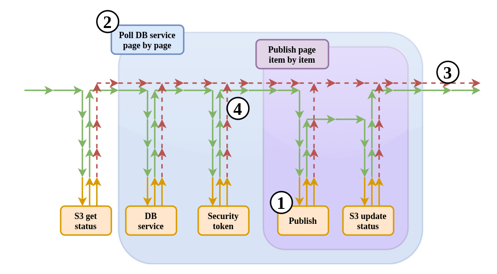

# Case study: Java functional programming using Vavr

Most Vavr tutorials shows how to use Vavr primitives, but they do not really provide intuition how to write whole applications.
This is something to be addressed here, by means of analysing some typical aspects of writing microservices.
Provided example has its roots in professional programming reality.

This post is neither introduction to functional programming (FP) nor Vavr tutorial.
Ideally, the reader should have been already exposed to Vavr (at least read the documentation).
Very basic understanding of FP concepts like immutability or pure functions is sufficient.

# Visualising programs as pipelines
Before jumping into the promised case study, let's try to plant the seed of the intuition to be developed.
In FP errors are not thrown as in pure Java are, but instead they are returned from functions similarly to correct values.
This allows us to visualise programs as pipeline, through which flow both correct results as well as errors.  

Just one remark here - one might argue whether the word 'pipeline' is appropriate or not.
Why not simply 'stream'? I find 'pipeline' accurate as streams need to flow through something.
From all such 'somethings' first things which comes to my mind is 'pipeline'.
And it stays in there after giving it a reasonable amounts of thoughts.  

Have a look at the pictures below:


They both present programs as pipelines. A single arrow should be interpreted as a single computational stage (for example a single method),
whereas colours mean:  
- green - purely functional (no side effects),  
- orange - with side effects (especially throwing errors),  
- red - flow of errors

Left example shows a purely functional program, meaning none of the pipeline stages performs any side effects.
It is hard to imagine that such program could be of any use - no side effects means no printing result on the screen/
writing to a file, no possibility to input parameters etc.  

The example on the right is more interesting - apart from doing purely FP-style calculations,
it reads user input, calls database service and is able to display some results on the screen.
Should any error occur, it will be wrapped (with help of Vavr) into a proper type and returned (not thrown) from a method.
The pipeline, assembled from Vavr primitives, takes care of proper error propagation to the place where program begins.

Writing programs in FP fashion is nothing more complicated than that - it is about assembling such pipelines.
Now we are ready to analyse a slightly more complicated program.

Some of it parts will serve as a decent examples of the most typical aspects to be dealt with.

# Case study - an example FP style microservice

Firstly, a picture worth more than 1000 words.
It depicts our microservice as a pipeline:



To describe it in one sentence - this is a service triggered once in a while which polls external database service for some data and publishes them to 
another endpoint.
Additionally, it leverages S3 to store some basic information about where he previously finished -
it is useful for both next service runs as well to know from where to continue after crashes.

The exact algorithm describing the service functionality is as follows:
- get last 'polling status' from S3
- use it to compose query to the database
- knowing that database response might consist of multiple pages, for each page (large loop on the picture):
- request access token 
- (small loop) publish to external endpoint (using access token) all entries from a single page, one at a time;
after each such successful operation, update 'polling status' on S3.

This example is based on a real example.
It is built without any frameworks apart from Guice to provide dependency injection, but this is irrelevant here.
To avoid overcomplication, everything happens in one thread.
Additionally, error while contacting any of external services means the pipeline breaks.
(OK, some failed HTTP calls might be retried two or three times, but if this fails the pipeline breaks.
This is acceptable - thanks to storing 'polling status' on S3, the next run will continue from the place where previously broke).

All external services are exposed through REST, but it does not really matter here.
What is important is that contacting them is side effect.

Having understood the flow of the service, we are ready to analyse some of its crucial parts to learn how Vavr helps in achieving that.

## Initial considerations
Vavr equips us with two ways of building pipelines: classes Either and Try.
Since Try might be treated as a specific case of Either, for the needs of this case study it does not really matter which one we choose.
Let's choose Either and base all examples on it.

## Aspect 1 - external services calls
External services calls produce side effects. In particular they might throw exceptions.
In order to 'plug' them into our pipelines, such calls needs to be appropriately wrapped.

Let's take a look at the class responsible for publishing events to external endpoint through REST.
It shows how to wrap a HTTP call which might throw an exception.
Should an exception be thrown, it will be wrapped into Try, and then translated to Either.Left and returned from method.
(note: of course, when you base your pipeline on Try, conversion to Either is not necessary).

Let's assume external HTTP calls are done by client implementing following interface:
```
interface InventoryPublisherClient {
    Boolean publishItem(ItemData item) throws RuntimeException;
}
```
Then our wrapper class may simply take form of:
```
@Value
class InventoryPublisher {
    private final InventoryPublisherClient inventoryPublisherClient;

    public Either<Throwable, Boolean> publishItem(ItemData item) {
        return Try.of(() -> inventoryPublisherClient.publishItem(item))
                .toEither();
    }
}
```

This schema is universal to all throwing methods.
Once again - just wrap them before plugging into the pipeline.  
Code with unit tests is available
[here](./code-examples/src/test/java/com/pbroda/codesnippets/vavr/ExternalServiceCall.java).

## Aspect 2 - handling loops
From the picture presenting our microservice we may tell that it has at least two loops.
Neither Vavr documentation, nor most of the tutorials on the Internet does not teach us how to deal with them properly using Vavr.
They explain only trivial scenarios, not diving into even slightly more complicated ones.
We are going to fill this gap and analyse here one such case in details.
We show how to write a loop where number of iterations is determined by the result returned from a call to an external service.

Let's talk about some basics first.  
Vavr equips us with tools one may find valuable writing such loops.
These are primitives like Stream.continually(), takeWhile(), dropWhile() and find().
And their 'brothers and sister' (takeUntil() etc.).  

**Now comes a very important thing, crucial to understanding this paragraph.
The io.vavr.collection.Stream implementation is a lazy linked list.**
This has very serious consequences which one might observe with following snippet:

```
testStream = Stream.of(pr1, pr2, pr3, pr4, pr5, pr6);
testList = List.of(pr1, pr2, pr3, pr4, pr5, pr6);

@Test
void testFind() {
    var resultStream = testStream.map(
            pr -> anyServiceStream.serviceCall(pr) # it returns false for the first three calls, true for the rest
        )
        .find(processingResult -> processingResult.isResult() == false);

    var resultList = testList.map(
            pr -> anyServiceList.serviceCall(pr) # it returns false for the first three calls, true for the rest
        )
        .find(processingResult -> processingResult.isResult() == false);

    verify(anyServiceStream, times(3)).serviceCall(any()); // result of implementation Stream as lazy linked list
    verify(anyServiceList, times(6)).serviceCall(any());

    assertEquals(Some(pr3), resultStream);
    assertEquals(Some(pr3), resultList);
}
```

One might clearly observe that lazy implementation of Stream class causes that anyServiceStream.serviceCall(pr)
will be called as many times as needed to fulfill find() condition. 
This is not the case for the List - anyServiceList.serviceCall() will be executed as many times as there are elements in testList.

Unit tests showing not only find() behaviour but also other mentioned functions can be found
[here](./code-examples/src/test/java/com/pbroda/codesnippets/vavr/LoopBasics.java).

Now it is time for our example. 
Assume, we want to call two services in a loop (this correspond to the bigger rectangle on the picture)
We call them consecutively in such way that the result of the first call is fed to the second call.
This proceeds in a loop until there is a certain condition met, based on the results of a first call.
Let's repeat to as it is important - first call, not the second one.

If it is not obvious how to write such loop, we might first try to write it as kind of pseudo-code presented below.
Unit tests not only assure us the functionality is correct, but also allow us with experimenting on the way to get a nice end result.
So our first version might look like: 
```
@Value
class ProcessingPipeline {

    private final WarehouseService warehouseService;
    private final InventoryService inventoryService;

    public Either<Throwable, Boolean> processItems() {
        AvailableItemsResponse availableItemsResponse;
        do {

            var fetchResult = warehouseService.fetchAvailableItems();

            if (fetchResult.isLeft()) {
                return Either.left(fetchResult.getLeft());
            }

            availableItemsResponse = fetchResult.get();

            var publishResult = inventoryService.publishAvailableItems(availableItemsResponse.getItems());
            if (publishResult.isLeft()) {
                return Either.left(publishResult.getLeft());
            }

        } while (availableItemsResponse.getHasMore() == true);
        return Either.right(true);
    }
}
```   

In order to refactor ProcessingPipeline class above we need to deal with two problems, both related to the condition
which terminates the loop:  
- it is based on the result of a service call - we have already covered it at the beginning of this paragraph,  
- it is based on the result of the first service call, as already stressed.

How to solve the latter? It would be no problem, if the condition ending the loop was based on the result of the second
call. That gives us a hint that we should make it this way - i.e. we should keep aside result of the first call,
perform second call, and return both together. We use Tuple to achieve that:

```
@Value
class ProcessingPipeline {

    private final WarehouseService warehouseService;
    private final InventoryService inventoryService;

    public Either<Throwable, Boolean> processItems() {
        return Stream.continually(() -> fetchAndPublishAvailableItems())
                .find(this::isLastPage)
                .get()
                .map(__ -> true);
    }

    private Either<Throwable, Tuple2<Boolean, Boolean>> fetchAndPublishAvailableItems() {
        return warehouseService.fetchAvailableItems()
                .flatMap(itemsResponse -> publishAvailableItems(itemsResponse));
    }

    private Either<Throwable, Tuple2<Boolean, Boolean>> publishAvailableItems(AvailableItemsResponse itemsResponse) {
        return inventoryService.publishAvailableItems(itemsResponse.getItems())
                .map(published -> Tuple.of(published, itemsResponse.getHasMore()));
    }

    private Boolean isLastPage(Either<Throwable, Tuple2<Boolean, Boolean>> fetchAndPublishResult) {
        return fetchAndPublishResult.isLeft() ||
                (fetchAndPublishResult.isRight() && !fetchAndPublishResult.get()._2.booleanValue());
    }
}

```

The whole code, with definitions of both service calls can be found
[here](./code-examples/src/test/java/com/pbroda/codesnippets/vavr/LoopCaseStudy.java).

## Aspect 3 - logging
When logging methods we write are meant to just log messages passed to them, i.e. their signatures are of form:
```
void logInfo(String message) {...}
void logDebug(String message) {...}
void logError(String message) {...}
```
then they might be easily plugged into the pipeline:  
```.peek(v -> logInfo(createLogMessage(v))``` or  
```.peek(v -> logDebug(createLogMessage(v))``` or  
```.peekLeft(err -> logError(err, createLogMessage(v))```  

However, one might be tempted to write logging methods such that (internally) they call other methods with side effects.
Example signature of such method would be:
```
public static <T> Either<Throwable, T> logInfo(T rightValue, String message) {...}
```
and then plugged into the pipeline using map() instead of peek().
```
.map(value -> logInfo(value, "log message"))
```

I would rather advice to split such method into two parts: just logging and the rest with side effects.
Apart from sticking to single responsibility rule, it would be great to have methods to log all levels (info, debug, error etc.)
in a consistent way.
And that becomes hard for writing logError() method.
LogError() method is suppose to log exceptions, but it would be plausible that logError() itself would result in an exception.
It would be still feasible to code it, with for example help of 'suppressed' exceptions, but one might unnecessarily
end up here with overcomplicated code.

## Aspect 4 - exceptions
Exceptions simply travel through the pipeline as Either.Left.
As they are making their way towards the end of the pipeline, there might be a need of translating them.
In our example we are in a very comfortable situation in which we allow them to propagate to the very end and log them there - just in one place.
Should any translation of an error be needed at any stage of the pipeline, then simply:
```
.mapLeft(err -> translateError(err))
```

What is more, I also consider a good practice wrapping the starting point of an application with Try:
```
public static void main(String[] args) {
    Try.of(() -> startApplication())
        .onFailure(t -> logError(t, "Service failuer"))
}
```
so that we have at least a chance to log all exceptions not caught by our more granular instances of Try.of().

## Other aspects - with or without ifs?
Both Java Streams and Vavr allow us to remove ifs from the code completely.
For example, instead of:
```
public boolean filter(String label) {
    if (label == null || label.isBlank()) {
        return false;
    }
    if (!allowedLabels.contains(label.toUpperCase())) {
        return false;
    }
    return true;
}
```

one might refactor it to:
```
public boolean filter2(String label) {
    return Option.of(label)
            .map(String::toUpperCase)
            .filter(allowedLabels::contains)
            .map(__ -> true)
            .getOrElse(false);
}
```

Which for is better? IMHO it depends:
- if there are no side effects involved, just pure logic like in the example above, the it is a matter of personal taste,  
- if there are side effects involved, I would compose code into a pipeline as this allow to propagate exceptions nicely:  

```
public Either<Throwable, Boolean> filter3(String label) {
    return Option.of(label)
            .map(allowedLabelsService::isAllowed)
            .getOrElse(() -> Either.right(false));
}
```

All three methods (filter1, filter2 and filter3) with unit test can be found
[here](./code-examples/src/test/java/com/pbroda/codesnippets/vavr/WithOrWithoutIfs.java).

# Summary
The case study presented above should enable the reader to write Java microservices in functional style using Vavr.
It may also serve as a proof that it is not necessary to even mention (in)famous 'm-word' in order to talk about FP usage in practice!
