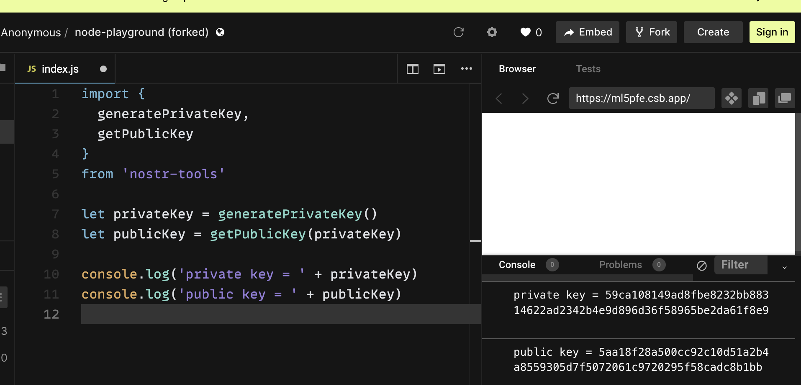

# Tinkering with the NOSTR protocol. Will it take Twitter over?

The landscape of social media is constantly evolving and it's only a matter of time before we see successors to the current leaders in the space.
Nothing lasts forever. New ideas pop up constantly, creating a lot of buzzes.
They often catch the attention of the industry gurus like [Jack Dorsey](https://twitter.com/jack), one of Twitter's co-founders.
He has been vocal about his belief in decentralization and censorship resistance as crucial components of the new protocols being developed.
NOSTR, which stands for: "Notes and Other Stuff Transmitted by Relays", is among the projects he (also financially) supports.

The simplicity of the NOSTR protocol is what makes it so compelling.
The aim of this article is to demonstrate this by experimenting with reading and writing simple posts.

We will help ourselves with simple JavaScript snippets as we proceed, but no coding skills are required.
All examples provided can be followed with the help of using free online tools.
Please keep in mind that this is still a developing area and there may be some rough edges, but with progress comes innovation.
I hope you find this article educational.

**Do not be afraid to experiment. If anything from this post won't work, try to find an alternative.**

If you hear about NOSTR for the first time, you should read some basics before jumping into the rest of the article.
Not to repeat what has been already written, you may want to familiarize yourself with the following:
1. https://github.com/nostr-protocol/nips for formal description, NIP-01 should suffice for the first read.
2. https://github.com/nostr-protocol/nostr for a more human-friendly explanation.
3. https://github.com/aljazceru/awesome-nostr to see a list of existing clients/servers (pardon, relays in NOSTR parlance).
I used a decent web browser client: [Coracle](https://coracle.social/notes/network).
Worth trying is an iOS [Damus](https://twitter.com/damusapp) client, which is in test flight at the time this post is being written.

## Reading posts
As a starting point let's try to read any post. From NIP-01 we see that we need to send a `"REQ"` event to a relay.
Communication is done using WebSockets. If you are not familiar with WebSockets, don't worry.
See it as an alternative to HTTPS. The difference is that WebSockets allow for real-time, bidirectional communication between a client and server.
The easiest way to experiment with them is to use any online tool, like [websocketking](https://websocketking.com/).
If you are familiar with [Postman](https://www.postman.com/) tool or a [websocat](https://github.com/vi/websocat) utility, they are also a good choice.

To fetch an HTTPs page from a server you need addresses like `https://...`.
Similarly, you need a WebSocket 'address' in the form of `wss://...`.
The fastest way is to take it from a preconfigured list of relays each client should have.
Using the abovementioned client and its relays list [Coracle relays](https://coracle.social/relays) we can try to connect to the following WebSocket: `wss://bitcoiner.social`.

Let's take the simplest possible request:
```
["REQ"]
```

and send it out:


It doesn't work, but it is a good starting point. Based on the error and NIP-01 you can try to figure out the rest yourself.
After a few trials and errors, the simples request seems to be:
```
["REQ","0",{}]
```

You may want to experiment and set some filters to limit the number of posts (or 'notes' using NOSTR parlance).
To see just the notes describing users (kind of list of users for this relay):
```
["REQ","0",{"kinds":[0]}]
```

## Writing posts
Writing is more complicated, but only a bit. The reasons are:
1. You do not need to be registered, although you have to identify yourself with a public key. The private key is used to sign events.
2. Some relays require a subscription for writing to them ([Coracle](https://coracle.social/notes/network) requires paying a Lightning invoice).
   It did not take long to find a free relay: `wss://nostr.pleb.network`.
3. Events need to be signed. To do that, let's:  
   a) https://github.com/nbd-wtf/nostr-tools - a great cheat sheet for us (it is a collection of utilities to build proper clients).  
   b) https://codesandbox.io/s/node-playground-forked-ml5pfe?file=/src/index.js - an online node.js interpreter.

Before creating our first post, let's generate our keys first.
You know the drill - you should keep the private key safe and not share it with anybody.

Let's use the node.js playground. Take the following snippet:
```
import {
  generatePrivateKey,
  getPublicKey
}
from 'nostr-tools'

let privateKey = generatePrivateKey()
let publicKey = getPublicKey(privateKey)

console.log('private key = ' + privateKey)
console.log('public key = ' + publicKey)
```

paste it into the node playground, and save aside the keys printed as the output:



Now we are ready to send our first post. To get the body of the request, use the following snippet, substituting your private key:

```
import {
  signEvent,
  getEventHash,
  getPublicKey
} from 'nostr-tools'

let privateKey = '<your private key>'

let event = {
  kind: 1,
  created_at: Math.floor(Date.now() / 1000),
  tags: [],
  content: 'Hello world!',
  pubkey: getPublicKey(privateKey)
}

event.id = getEventHash(event)
event.sig = signEvent(event, privateKey)

let event_publish = ['EVENT', event]

console.log(
  JSON.stringify(event_publish, null, 2)
)
```

This way, we obtained an event to publish, signed with our private key:


However, using the same relay we used for reads is not possible - it would give us: `"blocked: pubkey not admitted"`.
We have to either subscribe or find another relay.
The latter is quicker, especially if you haven't used Lightning payments yet.
Let's use: `wss:nostr.pleb.network` to send it out:


It is as simple as that. Really! This way you also respond to the posts of others.
What is a typical situation is that the whole thread - i.e. a post and all responses to it might be hosted on different relays.
The idea is one can easily, if needed, transfer posts to another relay or easily spin up its own.

## Is that all?
When we talk about the complexity of the protocol - **YES!**.

When we talk about possibilities - NO. **Definitively NO!**

By far, we have investigated only the basic protocol functionality.
The best way to discover its full potential is to go through the rest of NIP.
You will see there building blocks of contemporary social media.
There are, among others, human-readable names (as opposed to using pub keys :-)), mentions, encryption of messages or creation of chat channels.

## Summary
Based on just NIP-01 you see the protocol is straightforward.
Going through all the NIP can be comprehended in one or two evenings.
The ecosystem around NOSTR grows but it is still in its infancy.
I am waiting with my fingers crossed to see how NOSTR's fate and that of its competitors will unfold.
